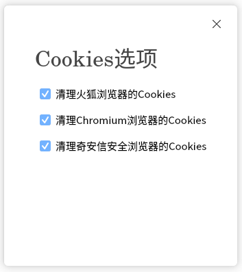
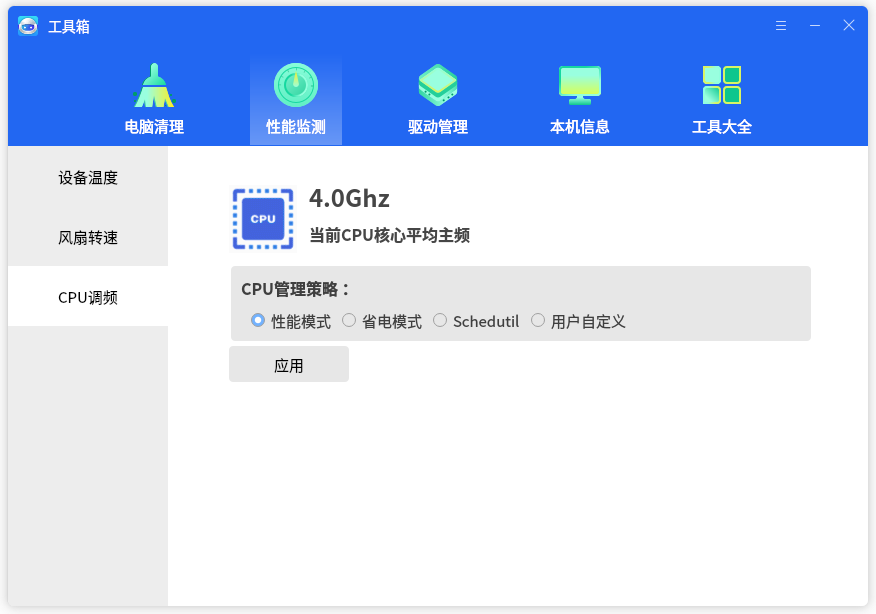
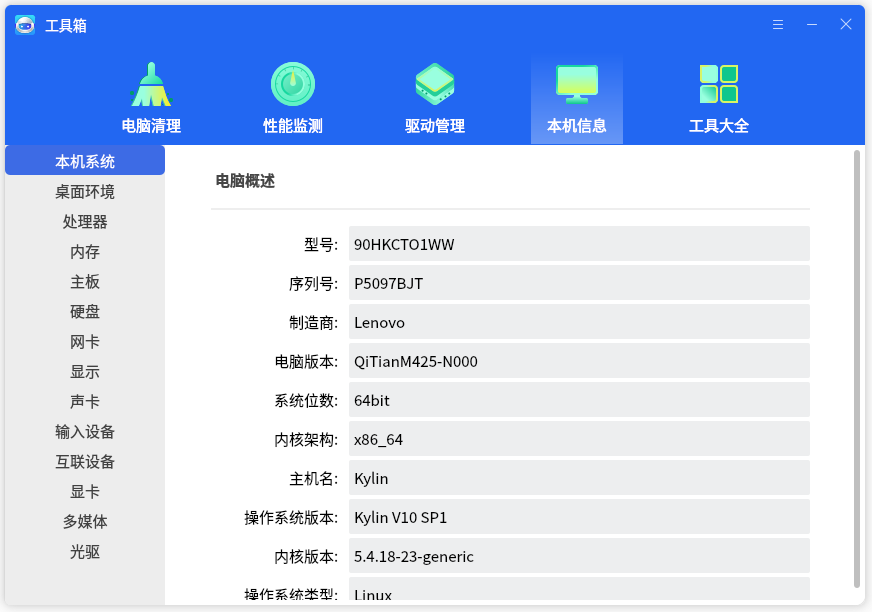
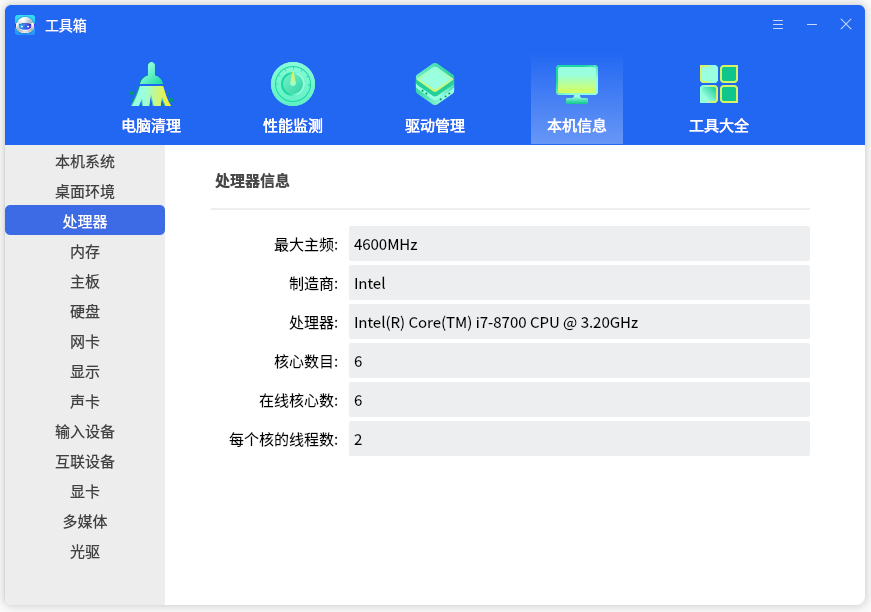
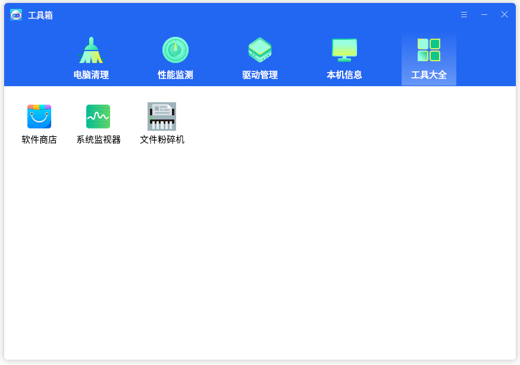

# 工具箱
## 概 述
工具箱提供了电脑清理，性能监测，查看本机信息等功能。主界面如图1所示。

 

## 电脑清理
“电脑清理”提供“系统缓存”、“Cookies”、“历史痕迹”三个扫描项。

-  **系统缓存**

点击“系统缓存”图标，弹出选项页面如图2所示。
 

用户可根据需要进行勾选，只有勾选状态下的选项才会扫描。

- **Cookies**

点击“Cookies”，弹出选项页面如图3所示。
 

- **历史痕迹**

点击“历史痕迹”，弹出页面如图4所示。
 

用户可根据需要进行勾选，只有勾选状态下的选项才会扫描。

点击“开始清理”按钮，扫描完成后如图5，点击“一键清理”即可。
 

 

## 性能监测
如图6所示，用户可设置CPU管理策略。

自定义模式如图7所示。

 

## 驱动管理
界面如图8所示，显示了计算机中的各个驱动信息。

 

## 本机信息
1）本机系统：显示计算机的基本信息。

2）点击其他项目，切换到该硬件的详细信息标签页。

 

## 工具大全
如图11所示，提供了软件商店，系统监视器，文件粉碎机的快捷入口。
 

