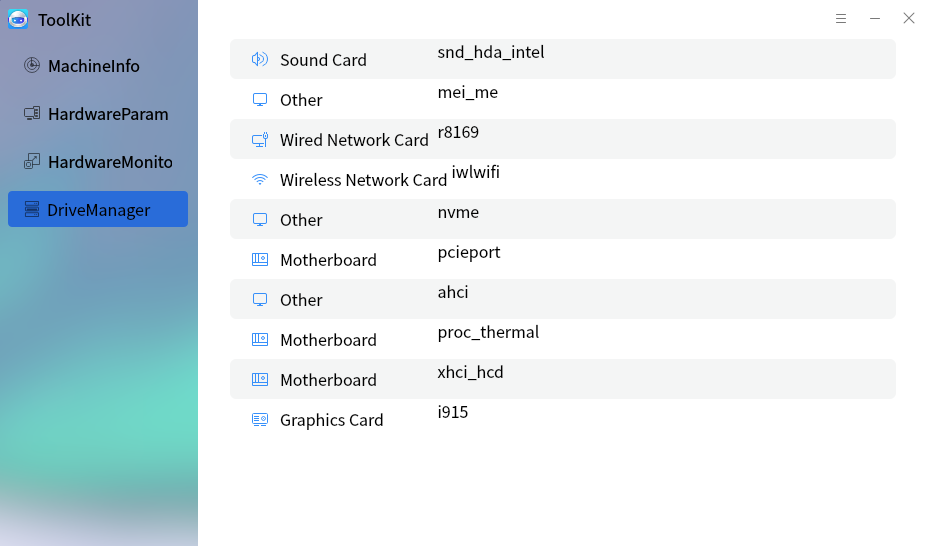

# ToolKit
## Overview
ToolKit provides some extended functions and users can query the hardware details of the current computer. The main interface as shown in Fig 1.

 

## MachineInformation

As shown in Figure 2, the general information of the whole machine is displayed.

 

##  HardwareParameters 

1） Processor: displays details of the computer's processor. 

2）Memory: displays details of the computer's memory.

3）Click other items to switch to the hardware details tab.

 

## HardwareMonitoring

1）Equipment monitoring, users can view the temperature and utilization of hardware equipment.

2）CPU frequency modulation, user can set CPU management policy.

 

## DriveManager

The interface is shown in Figure 9, which displays each driver information in the computer.

 

