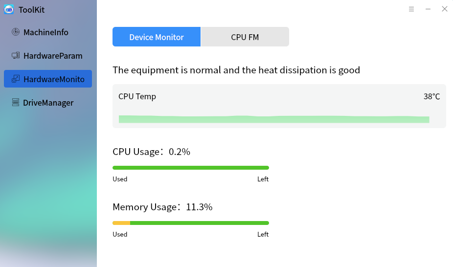

# ToolKit
## Overview
ToolKit provides some extended functions and users can query the hardware details of the current computer. The main interface as shown in Fig 1.

 

## Cleanup
It provides "Cache", "Cookies", and "Trace". Click "Start Clean". If the scaned item exist garbages, it will show on the window.

Click the corresponding icon and check the items to be cleaned in the popup.

 

## Monitoring
The interface as shown in Fig 3.

 

## Driver
The interface as shown in Fig 4. Here are all drivers in this computer.

 

## Sysinfo
- Local System: Obtain computer hardware details and system informations from the bottom of the system, as shown in Fig 5. The item won't be shown if this hardware doesn't exist or doesn't obtain its information.

- Hardware Information: Clicking a item at the left of the window to switch to its details. Take "HD" for example:
 

 

## Toolkits
It's developed by the form of plugin, as shown in Fig 7.
 

