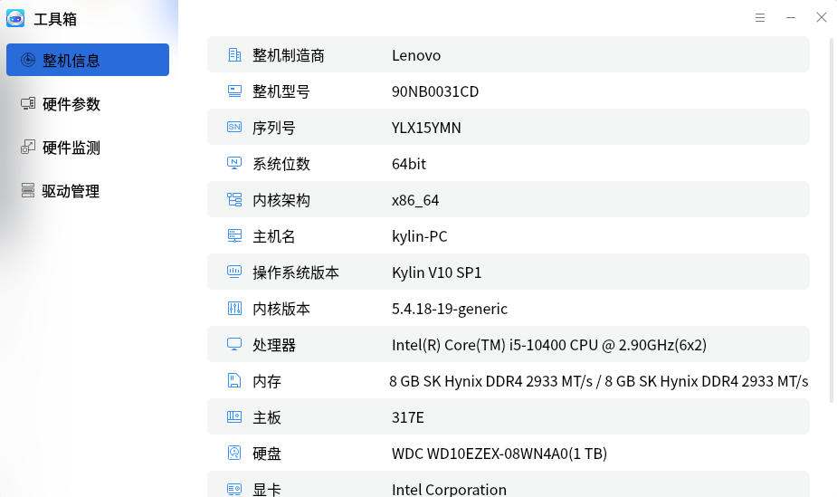
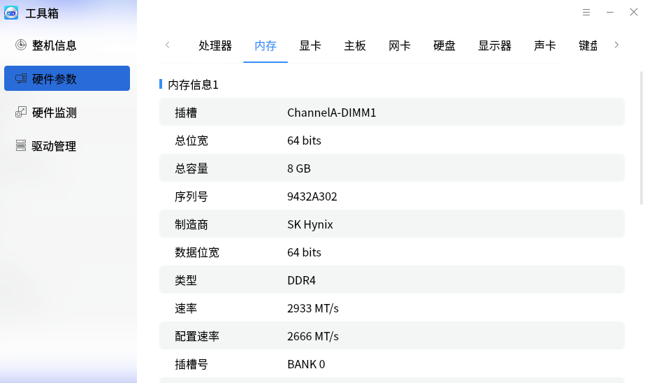
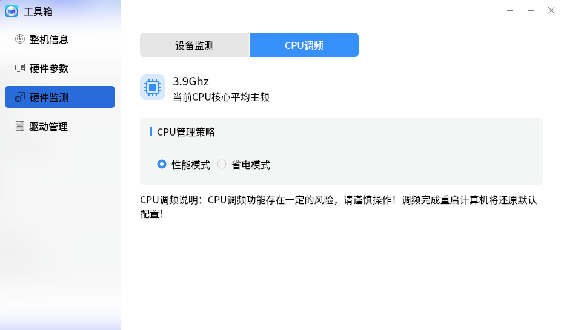

# 工具箱
## 概 述
工具箱提供了整机信息，硬件参数，硬件监测等功能。主界面如图1所示。

 

## 整机信息

如图2所示，展示整机的概要信息。

 

## 硬件参数

1）处理器：显示计算机处理器的详细信息。

2）内存：显示计算机内存的详细信息。

3）点击其他项目，切换到该硬件的详细信息标签页。

 

## 硬件监测
1）设备监测，用户可查看硬件设备温度和使用率。

2）CPU调频，用户可设置CPU管理策略。

自定义模式如图8所示。

 

## 驱动管理
界面如图9所示，显示了计算机中的各个驱动信息。

 

